<div align="center">

<a href="https://git.io/typing-svg">
  
</a>

<br/><br/>

<a href="../../actions/workflows/deploy-vless.yml">
  
</a>


<br/>


<br/>

<a href="../../stargazers">
  
</a>
<a href="../../forks">
  
</a>
<a href="../../issues">
  
</a>


</div>

---

<p align="center">
  <a href="#">
    
  </a>
</p>

---

<div align="center">

[](#-english-documentation "English")
&nbsp;&nbsp;
[](#-مستندات-فارسی "Persian")

</div>

---

# 🇺🇸 English Documentation

## ⚡ What is CloudBreak?

**CloudBreak** is a one-click, zero-cost VLESS + VMess proxy engine that runs entirely on **Cloudflare Workers** — deployed in under 60 seconds via GitHub Actions. It defeats Deep Packet Inspection (DPI) not by faking legitimacy, but by *being* legitimate.

> **The key insight:** Tools like V2Ray's Reality protocol *fake* a legitimate TLS certificate.
> CloudBreak doesn't fake anything — Cloudflare **is** a legitimate host with a **real** cert
> on a **real** globally-routable domain. DPI sees nothing but ordinary Cloudflare HTTPS traffic.

---

## 🌐 Traffic Flow

<p align="center">
  <a href="#">
    
  </a>
</p>

---

## 🛡️ DPI Evasion — How It Works

| What DPI inspects | What DPI actually sees |
|---|---|
| 🔍 Destination IP | Cloudflare anycast IP — globally trusted CDN |
| 🔍 TLS certificate | Genuine Cloudflare cert — full valid chain |
| 🔍 Server Name Indication | Real `*.workers.dev` — whitelisted worldwide |
| 🔍 TLS fingerprint | Standard TLS 1.3 — Chrome browser profile |
| 🔍 HTTP headers | Normal `Connection: Upgrade` WebSocket handshake |
| 🔍 Traffic pattern | Indistinguishable from HTTPS web browsing |
| 🔍 Port number | `443` — never blocked by any ISP |
| 🔍 Application payload | Encrypted VLESS frames inside TLS — fully opaque |

---

## ✨ Features

<table>
<tr>
<td width="50%">

**🔒 Genuine TLS — Not Fake**
Cloudflare's real certificate with full chain validation. No Reality tricks needed.

**🌍 200+ Edge Locations**
Traffic exits at the nearest Cloudflare PoP to the destination server.

**🎲 Random WS Path Per Deploy**
12-hex-char random path every run. No static fingerprint to blacklist.

**🔑 Per-Deploy UUID Rotation**
Fresh UUID from kernel entropy every run. Old configs expire automatically.

</td>
<td width="50%">

**📡 Dual Protocol — VLESS + VMess**
One worker, one subscription URL, two protocols for maximum compatibility.

**💸 Free Forever**
Cloudflare Workers: 100k req/day. GitHub Actions: 2,000 min/month. Cost: **$0**.

**🚀 60-Second Deploy**
GitHub Actions handles everything: keygen → deploy → health check → QR codes.

**🔄 One-Click Key Rotation**
Re-run the workflow. New UUID, new path, new QR codes. Done.

</td>
</tr>
</table>

---

## 📋 Prerequisites

| Requirement | Where to get it |
|---|---|
| ☁️ Cloudflare account (free) | [dash.cloudflare.com](https://dash.cloudflare.com) |
| 🐙 GitHub account (free) | [github.com](https://github.com) |
| 🔑 Cloudflare API Token | Dashboard → My Profile → API Tokens → *Edit Cloudflare Workers* template |
| 🆔 Cloudflare Account ID | Dashboard → Workers & Pages → right sidebar |

---

## 🚀 Quick Start

### Step 1 — Fork

Click **Fork** at the top right of this page.

### Step 2 — Add Secrets

**Settings** → **Secrets and variables** → **Actions** → **New repository secret**

| Secret name | Value |
|---|---|
| `CLOUDFLARE_API_TOKEN` | API token with `Workers Scripts:Edit` permission |
| `CLOUDFLARE_ACCOUNT_ID` | Your 32-character Cloudflare account ID |

### Step 3 — Run the Workflow

1. **Actions** tab → **"⚡ Deploy CloudBreak Worker"**
2. Click **Run workflow**
3. Optionally set a custom worker name (default: `vless-ir`)
4. Click the green **Run workflow** button

### Step 4 — Get Your Config

When the workflow finishes (~60s), open the run summary:
- 📱 Two QR codes — scan with your client
- 🔗 VLESS and VMess links — copy/paste
- 📡 Subscription URL — import into any client
- 📦 Download the **config artifact** for offline use

### Step 5 — Connect

| Method | Steps |
|---|---|
| 📱 **Scan QR** | V2rayNG → `+` → Scan QR → scan VLESS QR from summary |
| 📋 **Paste Link** | Copy `vless://...` or `vmess://...` → import in your client |
| 🔗 **Subscription** | Add `/sub` URL as subscription source — auto-updates on redeploy |

---

## 📱 Compatible Clients

| Client | Platform | VLESS | VMess | Subscription |
|---|---|:---:|:---:|:---:|
| [Hiddify](https://github.com/hiddify/hiddify-next) | All platforms 🇮🇷 | ✅ | ✅ | ✅ |
| [V2rayNG](https://github.com/2dust/v2rayNG) | Android | ✅ | ✅ | ✅ |
| [V2rayN](https://github.com/2dust/v2rayN) | Windows | ✅ | ✅ | ✅ |
| [Streisand](https://apps.apple.com/app/streisand/id6450534064) | iOS | ✅ | ✅ | ✅ |
| [Shadowrocket](https://apps.apple.com/app/shadowrocket/id932747118) | iOS | ✅ | ✅ | ✅ |
| [Clash.Meta](https://github.com/MetaCubeX/mihomo) | All platforms | ✅ | ✅ | ✅ |
| [NekoBox](https://github.com/MatsuriDayo/NekoBoxForAndroid) | Android | ✅ | ✅ | ✅ |
| [Xray Core](https://github.com/XTLS/Xray-core) | CLI | ✅ | ✅ | — |

---

## ⚙️ Manual Configuration

```
Protocol:     VLESS
Address:      your-worker-name.workers.dev
Port:         443
UUID:         (from workflow summary)
Encryption:   none
Transport:    WebSocket (ws)
WS Path:      /xxxxxxxxxxxx  ← 12 random hex chars, from summary
TLS:          true
SNI:          your-worker-name.workers.dev
Fingerprint:  chrome
ALPN:         h2, http/1.1
```

---

## 🔄 Key Rotation

Every workflow run:
1. **Deletes** existing worker (always starts fresh)
2. **Generates** new UUID from `/proc/sys/kernel/random/uuid`
3. **Generates** new WS path via `openssl rand -hex 6`
4. **Deploys** fresh worker with new credentials + new QR codes

The `/sub` URL always reflects the latest keys — subscription clients auto-update.

---

## 🌐 Optional: PROXYIP Chaining

If `workers.dev` is blocked by your ISP, set the `proxy_ip` workflow input to a relay server IP:

```
Client → Cloudflare Worker → Your Relay IP → Internet
```

---

## 🏗️ Project Structure

```
CloudBreak/
├── worker.js                         ← Cloudflare Worker (pure proxy engine, zero deps)
│   ├── VLESS header parser           ← Binary protocol implementation
│   ├── WebSocket ↔ TCP pump          ← Bidirectional relay
│   ├── /sub endpoint                 ← VLESS + VMess subscription feed
│   └── /health endpoint              ← JSON status check
│
├── .github/
│   └── workflows/
│       └── deploy-vless.yml          ← GitHub Actions pipeline
│           ├── Key generation         ← UUID + WS path from kernel entropy
│           ├── Wrangler deploy        ← Cloudflare Worker deployment
│           ├── QR code generation     ← Python qrcode library
│           └── Step summary           ← HTML summary with QR codes + links
│
├── assets/
│   ├── banner-ascii.svg              ← Animated ASCII logo (live gradient)
│   └── traffic-flow.svg             ← Animated traffic flow diagram
│
└── README.md                         ← You are here
```

---

## 🔐 Security Model

- UUID stored as Cloudflare Worker env var — **encrypted at rest by Cloudflare**
- UUID **never** stored in this repo or GitHub Secrets
- Each deploy generates completely new credentials — old configs stop working
- Random WS path — no discoverable default endpoint
- TLS terminated by Cloudflare — your device never handles raw TLS
- VLESS payload inside TLS — fully opaque to any DPI appliance

---

## 📄 License

This project is licensed under the **GNU General Public License v3.0** — see the [LICENSE](LICENSE) file for details.

---
---

# 🇮🇷 مستندات فارسی

<div dir="rtl">

## ⚡ CloudBreak چیست؟

**CloudBreak** یک پروکسی VLESS + VMess هست که روی **Cloudflare Workers** اجرا میشه و با یه کلیک از طریق GitHub Actions در کمتر از ۶۰ ثانیه دیپلوی میشه. هزینه؟ **صفر.**

> **نکته اصلی:** ابزارهایی مثل Reality پروتکل V2Ray سعی می‌کنن گواهی TLS رو جعل کنن.
> CloudBreak اصلاً نیازی به جعل نداره — Cloudflare خودش یه هاست واقعیه با گواهی واقعی
> روی دامنه واقعی. DPI چیزی نمی‌بینه جز ترافیک معمولی HTTPS کلاودفلر.

---

## 🔬 چطور فیلترینگ رو دور میزنه؟

ایران از **Deep Packet Inspection** یا DPI برای فیلتر کردن استفاده می‌کنه. این سیستم بسته‌های اینترنتی رو اسکن می‌کنه تا پروتکل‌های VPN و پروکسی رو شناسایی کنه.

| DPI دنبال چی می‌گرده | CloudBreak چی نشون میده |
|---|---|
| 🔍 آدرس IP مقصد | IP آنی‌کست کلاودفلر — CDN معتبر جهانی |
| 🔍 گواهی TLS | گواهی واقعی کلاودفلر — زنجیره کامل معتبر |
| 🔍 فیلد SNI | `*.workers.dev` واقعی — در وایت‌لیست همه‌جا |
| 🔍 اثرانگشت TLS | TLS 1.3 استاندارد — پروفایل مرورگر Chrome |
| 🔍 هدرهای HTTP | WebSocket upgrade کاملاً معمولی |
| 🔍 الگوی ترافیک | غیرقابل تشخیص از مرور عادی HTTPS |
| 🔍 شماره پورت | `443` — هیچ ISP‌ای این رو نمی‌بنده |
| 🔍 محتوای پکت | فریم‌های VLESS داخل TLS — کاملاً رمزنگاری شده |

---

## 🚀 شروع سریع (۵ قدم، ۲ دقیقه)

### قدم ۱ — Fork بگیر

دکمه **Fork** رو در بالای صفحه بزن.

### قدم ۲ — Secret اضافه کن

**Settings** → **Secrets and variables** → **Actions** → **New repository secret**

| نام Secret | مقدار |
|---|---|
| `CLOUDFLARE_API_TOKEN` | توکن API با دسترسی `Workers Scripts:Edit` |
| `CLOUDFLARE_ACCOUNT_ID` | شناسه ۳۲ کاراکتری اکانت |

**توکن API رو از کجا بگیری؟**
داشبورد کلاودفلر → My Profile → API Tokens → Create Token → قالب «Edit Cloudflare Workers»

**Account ID رو از کجا بگیری؟**
داشبورد کلاودفلر → Workers & Pages → نوار کناری راست

### قدم ۳ — Workflow رو اجرا کن

۱. تب **Actions** ← «⚡ Deploy CloudBreak Worker»  
۲. **Run workflow** ← اسم worker رو بذار (اختیاری)  
۳. دکمه سبز **Run workflow** رو بزن

### قدم ۴ — Config بگیر

وقتی workflow تموم شد (~۶۰ ثانیه)، صفحه **Summary** رو باز کن:
- 📱 دو QR کد — با کلاینتت اسکن کن
- 🔗 لینک‌های VLESS و VMess — کپی/پیست
- 📡 آدرس Subscription — در هر کلاینتی import کن

### قدم ۵ — وصل شو

| روش | مراحل |
|---|---|
| 📱 **اسکن QR** | V2rayNG رو باز کن → `+` → Scan QR → QR رو اسکن کن |
| 📋 **پیست لینک** | لینک `vless://...` رو کپی کن → import در کلاینت |
| 🔗 **Subscription** | آدرس `/sub` رو به عنوان subscription اضافه کن |

---

## 📱 کلاینت‌های سازگار

| کلاینت | پلتفرم | توضیح |
|---|---|---|
| [**Hiddify**](https://github.com/hiddify/hiddify-next) | همه پلتفرم‌ها | 🇮🇷 ساخت ایران — **توصیه شده** |
| [**V2rayNG**](https://github.com/2dust/v2rayNG) | اندروید | پرطرفدارترین کلاینت اندروید |
| [**V2rayN**](https://github.com/2dust/v2rayN) | ویندوز | بهترین کلاینت ویندوز |
| [**Streisand**](https://apps.apple.com/app/streisand/id6450534064) | iOS | رایگان برای iPhone |
| [**Shadowrocket**](https://apps.apple.com/app/shadowrocket/id932747118) | iOS | پولی ولی قوی |
| [**NekoBox**](https://github.com/MatsuriDayo/NekoBoxForAndroid) | اندروید | هسته SingBox |

---

## 🔄 چرخش کلید

هر بار که workflow رو اجرا کنی:
1. Worker قدیمی **حذف** میشه
2. **UUID جدید** از entropy هسته لینوکس تولید میشه
3. **مسیر WS جدید** با `openssl rand` ساخته میشه
4. Worker جدید با کلیدهای تازه **دیپلوی** میشه

آدرس `/sub` همیشه آخرین کلیدها رو داره — کلاینت‌ها خودکار آپدیت میشن.

---

## ❓ سوالات متداول

<details>
<summary><strong>اگه workers.dev خودش فیلتر بشه چی؟</strong></summary>

از قابلیت **PROXYIP** استفاده کن. یه IP رله‌ای که داری رو در ورودی `proxy_ip` وارد کن. ترافیک از طریق اون IP به اینترنت میره.

</details>

<details>
<summary><strong>محدودیت رایگان کلاودفلر چقدره؟</strong></summary>

Workers free tier: **۱۰۰٬۰۰۰ درخواست در روز**. برای استفاده شخصی کاملاً کافیه.

</details>

<details>
<summary><strong>UUID و کلیدهام کجا ذخیره میشن؟</strong></summary>

UUID فقط به عنوان env var در کلاودفلر ذخیره میشه — رمزنگاری شده توسط کلاودفلر. هرگز در این ریپو یا GitHub Secrets ذخیره نمیشه.

</details>

<details>
<summary><strong>چقدر سرعت داره؟</strong></summary>

سرعت بستگی داره به نزدیک‌ترین PoP کلاودفلر به شما. معمولاً برای استریم ویدیو و مرور وب کاملاً مناسبه.

</details>

</div>

---

<div align="center">


<br/>

[](../../stargazers)
&nbsp;
[](../../forks)
&nbsp;
[](https://github.com/RANGER-exe)

<br/>

*Built with ❤️ by [RANGER-exe](https://github.com/RANGER-exe) — for everyone behind a wall.*

<br/>

`GPL-3.0` &nbsp;·&nbsp; `Cloudflare Workers` &nbsp;·&nbsp; `VLESS + VMess` &nbsp;·&nbsp; `DPI-Proof`

</div>
